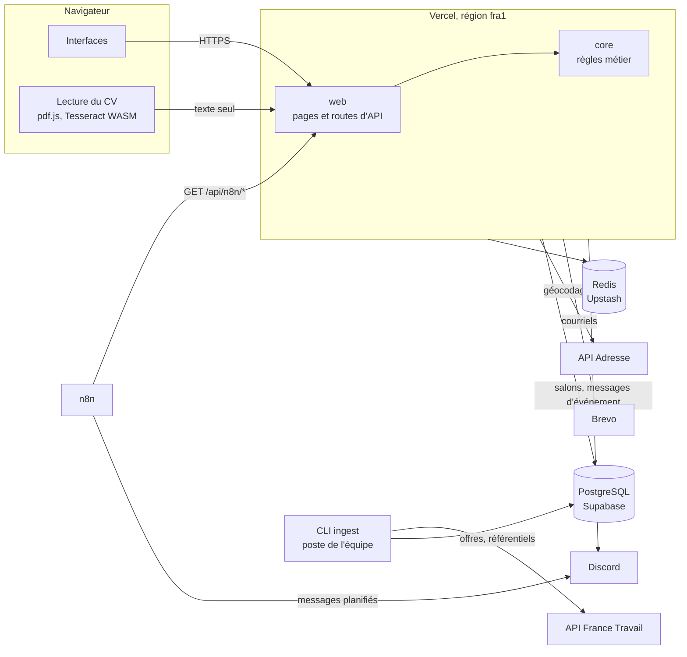
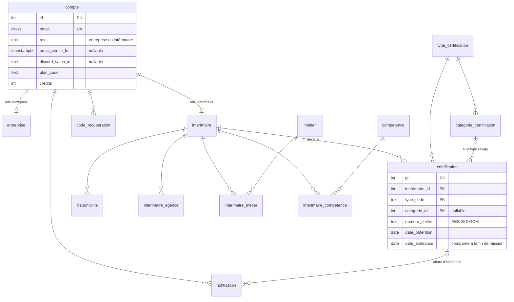
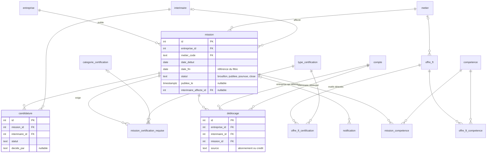
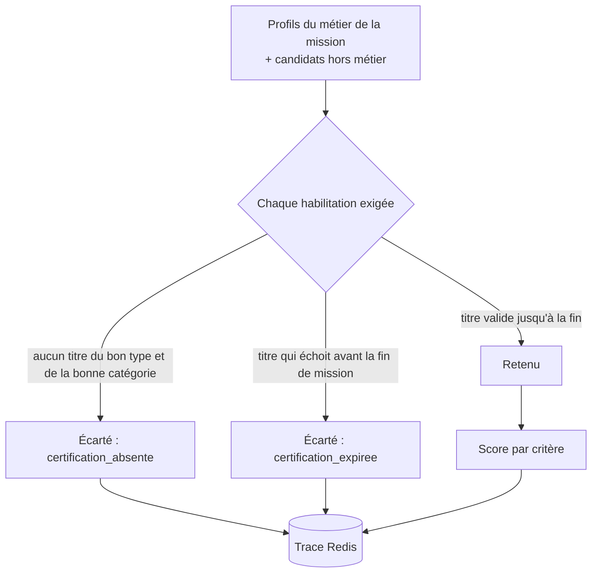
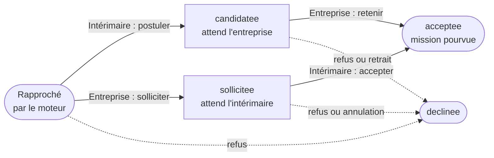

# Architecture

Ce document décrit comment le système est construit : les modules, les données, le
moteur de matching, l'ingestion des données publiques et les notifications. Les
raisons des choix sont dans [decisions.md](decisions.md).

## Sommaire

1. [Vue d'ensemble](#vue-densemble)
2. [Organisation du dépôt](#organisation-du-dépôt)
3. [Modèle de données](#modèle-de-données)
4. [Moteur de matching](#moteur-de-matching)
5. [Cycle d'une candidature](#cycle-dune-candidature)
6. [Ingestion France Travail](#ingestion-france-travail)
7. [Base non relationnelle](#base-non-relationnelle)
8. [Notifications](#notifications)

---

## Vue d'ensemble



`web` et `core` sont déployés ensemble et appellent tous deux les services de droite :
les flèches partent donc du déploiement, pas d'une couche. La CLI d'ingestion tourne sur
un poste de l'équipe, pas sur Vercel ; elle réutilise le code de `core`.

| Composant | Technologie | Rôle |
|---|---|---|
| Application | Next.js 16 (App Router), React 19, TypeScript strict | Pages et API dans un même déploiement |
| Domaine | TypeScript pur (`core/`) | Règles métier sans dépendance au framework |
| Base relationnelle | PostgreSQL (Supabase), pilote `postgres.js` | Données structurées, via le pooler en mode transaction |
| Base non relationnelle | Redis (Upstash, client HTTP) | Sessions, limitation, jetons, caches, traces |
| Géocodage | API Adresse (BAN) | Commune et code postal vers coordonnées |
| Courriel | Brevo | Acheminement uniquement : jetons et contenus produits ici |
| Automatisations | n8n | Trois flux planifiés, tirés depuis l'application |
| Ingestion | CLI Node (`commander`) | Collecte et nettoyage des offres France Travail |

---

## Organisation du dépôt

Monorepo npm workspaces.

```
core/            domaine métier, publié en TypeScript source
  src/             matching, conformité, chiffrement, géocodage, droit du travail, offre
  migrations/      schéma SQL numéroté, rejoué dans l'ordre
  test/            tests unitaires
web/             application Next.js
  app/             routes : (entreprise), (interimaire), pages publiques, api/
  components/      composants d'interface
  lib/             accès aux données et logique propre à l'application
  test/            tests fonctionnels, contre un serveur réel
ingest/          CLI d'ingestion France Travail et jeu de démonstration
explo-api/       exploration initiale de l'API, conservée pour ses mesures
outils/          contrôles hors suite de tests : audit, parcours, fumée
docs/            documentation, exports n8n, cahier des charges
```

`web` dépend de `@interimatch/core`, transpilé par Next (`transpilePackages`).
`core` ne connaît ni Next ni React : tout ce qui décide d'une éligibilité y vit et s'y
teste unitairement.

---

## Modèle de données

22 tables métier (plus `schema_migrations`, tenue par le script de migration), 15
migrations (`core/migrations/`). Les deux diagrammes reprennent **toutes**
les clés étrangères de la base, relevées dans `information_schema` le 24 septembre
2026. Un `|o` du côté de la table référencée signale une clé étrangère facultative
(colonne qui peut être vide).

### Comptes, profils et habilitations



### Missions, candidatures et offres publiques



### Tables principales

| Table | Contenu | Règles portées par le schéma |
|---|---|---|
| `compte` | Identifiant, empreinte scrypt et sel, rôle, vérification d'adresse, rattachement Discord, palier et crédits | `role` ∈ {entreprise, intérimaire} |
| `interimaire` | Identité, commune géocodée, rayon de mobilité, carte BTP, texte de CV chiffré | Rayon par défaut 50 km. Carte BTP dans des colonnes à part, jamais dans `certification` |
| `certification` | Type, catégorie, organisme, numéro chiffré, dates d'obtention et d'échéance | `date_echeance > date_obtention`. Type et catégorie en clés étrangères : aucun texte libre possible |
| `type_certification` | Liste fermée des 9 types, durée de validité en mois, catégorie exigée ou non, URL de vérification de l'organisme | Données de référence, jamais saisies |
| `mission` | Poste, lieu géocodé, dates, horaires, rémunération, statut, intérimaire affecté | `date_fin` obligatoire : c'est la référence du filtre. Statut ∈ {brouillon, publiee, pourvue, close} |
| `mission_certification_requise` | Habilitations exigées par une mission | Mêmes clés étrangères que `certification` |
| `candidature` | Lien mission × intérimaire, statut, partie qui a décidé, motif | Une ligne par couple, créée à la première action (voir [cycle](#cycle-dune-candidature)) |
| `deblocage` | Accès d'une entreprise aux coordonnées d'un profil pour une mission | Unique par triplet entreprise × intérimaire × mission : débloquer deux fois ne débite qu'une fois |
| `offre_ft` | Offres France Travail nettoyées | Clé : identifiant France Travail ; `empreinte` pour les quasi-doublons |
| `notification` | Fil d'activité de chaque compte | Quatre types : mission correspondante, échéance, proposition, réponse |

### Référentiels

| Référentiel | Volume | Source |
|---|---|---|
| Métiers | 52, des domaines ROME F13, F15, F16 et F17 | Référentiel ROME des métiers de l'API France Travail (1 911 entrées), filtré par `seed-metiers`. La conception (F11) et l'encadrement (F12) ne sont pas semés |
| Types d'habilitation | 9 | Durées CNAM : CACES R482 10 ans, autres CACES 5 ans, habilitation électrique et amiante SS4 3 ans, SST 2 ans, AIPR 5 ans |
| Compétences | 299 | Compétences des offres ingérées |

---

## Moteur de matching

`core/src/matching.ts`. Fonctions pures : elles reçoivent une mission et des profils,
et rendent un résultat. Aucun accès à la base, aucun appel à l'horloge.



### Étape 1 : filtre éliminatoire

Pour chaque habilitation exigée, le profil doit détenir un titre du même type, de la
même catégorie quand le type en a une, et tel que :

```
certification.date_echeance >= mission.date_fin
```

La comparaison se fait contre la **date de fin de mission**. Un titre valide
aujourd'hui mais qui échoit pendant le chantier écarte le profil. Un profil écarté ne
reçoit pas de score.

### Étape 2 : score

Sur les seuls profils retenus. Chaque critère vaut entre 0 et 1 et reste exposé
séparément.

| Critère | Poids | Calcul |
|---|---|---|
| Compétences | 0,40 | compétences communes ÷ compétences requises ; 1 si aucune n'est requise |
| Distance | 0,35 | `max(0, 1 − distance ÷ rayon de mobilité)` ; 0 au-delà du rayon, sans exclusion |
| Disponibilités | 0,25 | jours de mission couverts par les disponibilités ÷ jours de mission |

Distance à vol d'oiseau (haversine) entre la commune de l'intérimaire et le chantier.

### Cache et trace

| Clé Redis | Contenu | Durée |
|---|---|---|
| `match:cache:<mission>` | Résultat complet | 15 min, invalidé à la modification de la mission ou d'un profil |
| `match:trace:<mission>` | Profils évalués, écartés avec motif, scores détaillés | 1 h |

La trace sert à répondre à « pourquoi ce profil n'apparaît-il pas ? ». Elle n'archive
rien.

---

## Cycle d'une candidature

Deux chemins mènent à une affectation, selon la partie qui fait le premier pas. Chacun
exige l'accord de l'autre.



**« Rapproché » n'est pas un état stocké.** Aucune ligne n'existe tant que personne n'a
agi ; la première action crée la ligne directement dans l'état visé. L'écran affiche
alors « proposée par le moteur ».

Toutes les transitions, par partie (`core/src/candidature.ts`) :

| Depuis | L'intérimaire peut | L'entreprise peut |
|---|---|---|
| Rapproché | Postuler → `candidatee` · Décliner → `declinee` | Solliciter → `sollicitee` · Écarter ce profil → `declinee` |
| `candidatee` | Retirer ma candidature → `declinee` | Retenir ce profil → `acceptee` · Écarter ce profil → `declinee` |
| `sollicitee` | Accepter la mission → `acceptee` · Décliner → `declinee` | Annuler ma sollicitation → `declinee` |
| `acceptee`, `declinee`, `expiree` | — | — |

Passage automatique à `expiree` : les candidatures encore en attente d'une mission qui
devient pourvue (par une acceptation, ou déclarée pourvue hors plateforme) ou close.

- **Aucune partie ne conclut seule.** Une transition demandée par la mauvaise partie
  est refusée (`409`) avec un message qui nomme la partie attendue.
- **La conformité est vérifiée à nouveau à l'acceptation.** Un titre peut échoir entre
  le rapprochement et la décision.
- **L'acceptation pourvoit la mission.** Les autres candidatures passent à `expiree`.
- **Solliciter suppose un déblocage.** Le contrôle est fait côté serveur (`402`).

---

## Ingestion France Travail

CLI `ingest/`, construite sur `commander`, qui réutilise le client OAuth2 de
`explo-api/`.

```bash
npm run ingest -- seed-metiers        # référentiel métiers, domaines de terrain seulement
npm run ingest -- fetch -d F13 F17    # collecte brute, mise en cache disque
npm run ingest -- clean               # nettoyage, hors ligne
npm run ingest -- load                # chargement en base
npm run ingest -- stats               # agrégats de contrôle
npm run ingest -- seed-demo           # jeu de démonstration
```

### Particularités de l'API

- Flux `client_credentials`, scope `o2dsoffre api_offresdemploiv2`.
- Le total de résultats se lit dans l'en-tête `Content-Range`, pas dans la longueur du
  tableau. Le statut `206` est une réponse normale en pagination.
- Appels espacés de 130 ms.

### Nettoyage

| Étape | Traitement |
|---|---|
| Intitulés | `romeCode` et appellation vers le libellé du référentiel. Offres hors des domaines de terrain rejetées |
| Rémunération | `salaire.libelle` est du texte libre (« Mensuel de 1 900 Euros à 2 100 Euros - Panier repas »). Extraction, puis conversion en taux horaire : mensuel ÷ 151,67, annuel ÷ 1 820 |
| Lieux | Coordonnées de l'offre reprises (97 % des offres en ont) ; les autres géocodées par code postal |
| Habilitations | Repérage de motifs dans l'intitulé et la description, projeté sur la liste fermée. Le signal n'existe que pour les CACES, l'habilitation électrique et l'AIPR |
| Doublons | Exact sur l'identifiant d'offre, approché sur une empreinte (intitulé normalisé, commune, entreprise) |
| Dates | ISO 8601 |

Mesures de l'échantillon initial (600 offres d'intérim, 16 septembre 2026) : la
description est toujours présente, la rémunération dans 87 % des cas, les coordonnées
dans 97 %. Aucun champ structuré ne porte les habilitations.

### Fonctionnalité alimentée

À la création d'une fiche de poste, dès que le métier est choisi, le formulaire propose
les intitulés fréquents, les habilitations typiques avec leur fréquence observée, et la
fourchette de rémunération locale (médiane et quartiles, avec le nombre d'offres qui
fondent le chiffre). Les compétences proposées au profil intérimaire sont aussi classées
par fréquence réelle dans les offres du métier.

Ce texte ne sert qu'à préremplir. L'entreprise confirme, seules des valeurs typées sont
enregistrées, et le moteur ne voit jamais la description d'une offre.

---

## Base non relationnelle

| Usage | Clé | Durée |
|---|---|---|
| Session | `sess:<jeton>` | 7 jours, glissante |
| Index des sessions d'un compte (révocation) | `sess:compte:<id>` | durée de la plus longue session |
| Tentatives de connexion par adresse | `rl:email:<adresse>` | 15 min, seuil 10 |
| Tentatives de connexion par IP | `rl:ip:<ip>` | 15 min, seuil 100 |
| Demandes de réinitialisation | `rl:reinit:<adresse>` | 1 h, seuil 5 |
| Jeton à usage unique, rangé par empreinte SHA-256 | `jeton:<empreinte>` | 1 h (réinitialisation), 24 h (changement d'adresse), 48 h (vérification) |
| État OAuth Discord | `discord:etat:<état>` | 10 min |
| Cache de matching | `match:cache:<mission>` | 15 min |
| Trace de matching | `match:trace:<mission>` | 1 h |
| Cache de géocodage | `geo:<code postal>:<ville>:<adresse>` | 30 jours |

Une panne de Redis ne fait pas tomber les lectures : les accès au cache passent par
`sansEchec()`, qui journalise et laisse la requête se poursuivre sans cache.

---

## Notifications

Trois canaux, du plus fiable au plus facultatif.

| Canal | Contenu | Déclenchement |
|---|---|---|
| Fil d'activité dans l'espace | Tous les événements | Écrit par l'application au moment de l'événement |
| Courriel | Vérification d'adresse, réinitialisation, changement d'adresse | Application, via Brevo |
| Salon Discord privé | Mouvements de candidature, alertes des trois flux n8n | Application (événements) et n8n (flux planifiés) |

### Salons Discord

Chaque personne qui relie son compte obtient un salon que seuls elle et le bot peuvent
lire. Le rattachement passe par OAuth2 (scopes `identify` et `guilds.join`) ; aucune
adresse n'est demandée ni comparée. Le bot crée le salon, y ajoute la personne, et le
supprime au détachement ou à la suppression du compte. Un salon supprimé à la main est
recréé à la prochaine ouverture de l'écran de notifications.

### Flux n8n

n8n **interroge** l'application : il n'a pas besoin d'être joignable depuis
l'extérieur. Les trois points d'entrée exigent l'en-tête `x-secret-n8n`, comparé en
temps constant.

| Flux | Point d'entrée | Sélection | Destinataire |
|---|---|---|---|
| Alerte avant expiration | `GET /api/n8n/certifications-expirantes?jours=90` (max 365) | Habilitations qui échoient dans la fenêtre, avec le nombre de missions ouvertes qu'un renouvellement rendrait accessibles | intérimaire |
| Mission correspondante | `GET /api/n8n/missions-a-notifier?heures=24` (max 720) | Missions publiées dans la fenêtre ; matching rejoué, seuls les retenus | intérimaire |
| Relance non pourvue | `GET /api/n8n/missions-non-pourvues?jours=7` (max 90) | Missions publiées depuis au moins N jours, chantier non commencé | entreprise |

Chaque flux suit la même chaîne : déclencheur quotidien, appel API, éclatement du
tableau, filtre sur `discordSalonId` non vide, envoi dans le salon. Le texte du message
est rédigé par l'application ; n8n ne porte aucune règle métier. Mise en place :
[exploitation.md](exploitation.md#automatisations-n8n).
