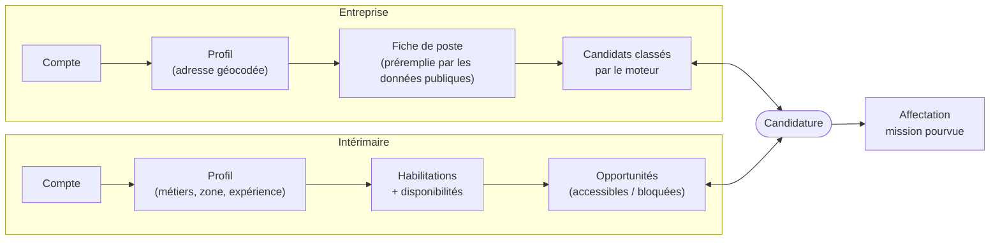
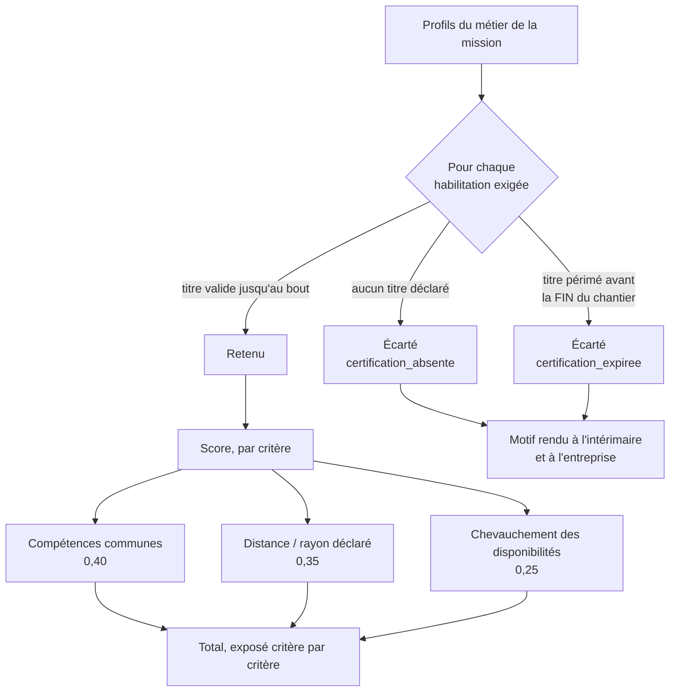
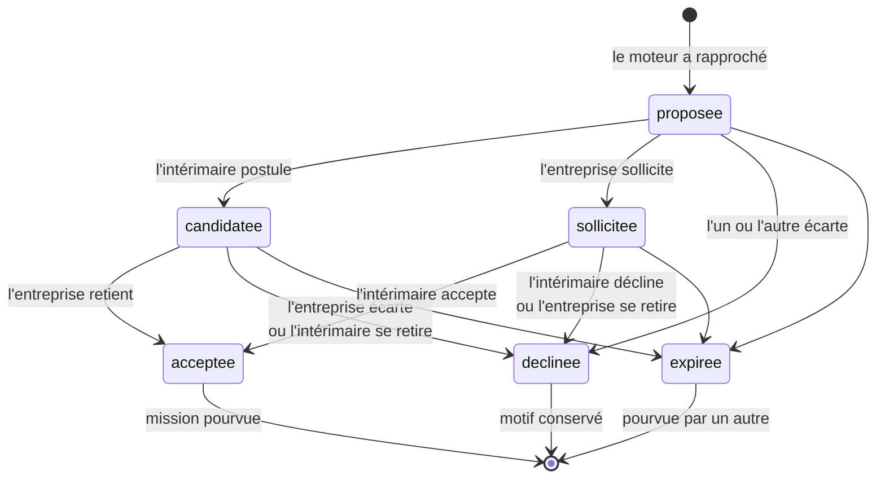
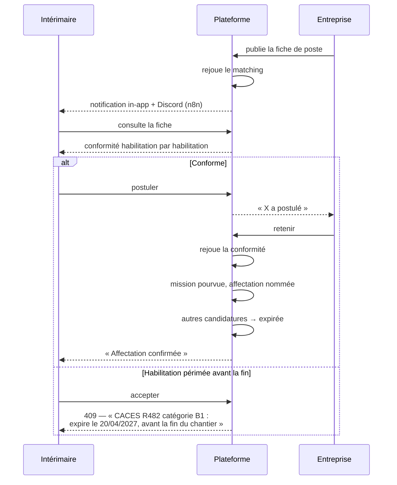

# Parcours de bout en bout

*Établi le 2026-09-21. Chaque étape décrite ici est **exécutée** par `npm run parcours`, qui vérifie trente-six propriétés contre une instance réelle. Les diagrammes décrivent ce qui se passe, pas ce qu'on croit qu'il se passe.*

```bash
npm run parcours                                    # contre le serveur local
npm run parcours -- https://mon-deploiement.app     # contre un déploiement
```

---

## Vue d'ensemble

Deux parcours qui se rencontrent en un point : **la candidature**. Ni l'un ni l'autre ne peut conclure seul.



---

## Ce que le moteur fait, et dans quel ordre

Deux étapes **strictement séquentielles**. Les fondre en un score unique reviendrait à laisser une bonne distance compenser une habilitation périmée.



**La comparaison porte sur la date de fin de mission, jamais sur la date du jour.** Un CACES valable aujourd'hui mais périmé avant la fin d'un chantier de trois semaines écarte le profil. `core/src/matching.ts` ne contient aucun `Date.now()` : c'est vérifiable par simple lecture, et un test de mutation prouve que la suite attrape la régression si on l'y introduit.

---

## Le cycle d'une candidature



**Aucune partie ne conclut seule.** Postuler n'affecte pas ; solliciter non plus. Vérifié : un intérimaire qui tente `acceptee` depuis `proposee` reçoit `409`.

**Le refus nomme celui dont c'est le tour.** Une entreprise qui a sollicité puis tente d'accepter lit *« Vous avez sollicité ce profil : c'est à lui d'accepter ou de décliner »* — et non « impossible », qui laisse croire à une panne.

---

## Le rapprochement, pas à pas



**La conformité est rejouée au moment d'accepter**, pas seulement au matching : un titre peut avoir expiré entre le rapprochement et la décision, et c'est l'affectation qui engage la responsabilité pénale de l'entreprise utilisatrice.

---

## Parcours intérimaire, A à Z

| # | Étape | Ce que le produit garantit |
|---|---|---|
| 1 | **Inscription** | 8 codes de récupération remis, affichés une seule fois, écran bloqué tant qu'on n'a pas confirmé les avoir notés. Un lien de confirmation part vers l'adresse saisie, **sans rien bloquer** |
| 2 | **Profil** | Métiers cherchables parmi 52, expérience déclarée par métier, commune géocodée, rayon de mobilité à 50 km par défaut |
| 3 | **Compétences** | Classées par fréquence réelle dans les offres France Travail du métier déclaré |
| 4 | **Habilitations** | Type dans une liste fermée, catégorie quand le type l'exige, organisme, numéro chiffré, dates d'obtention et d'échéance |
| 5 | **Disponibilités** | Périodes, qui pèsent 0,25 dans le score |
| 6 | **CV** *(facultatif)* | Lu **dans le navigateur** — le document ne part jamais. Propose métiers et compétences, chaque détection accompagnée du passage qui l'a déclenchée |
| 7 | **Opportunités** | Accessibles et **bloquées séparées**, les bloquées portant le titre manquant et sa date |
| 8 | **Fiche de mission** | État de chaque habilitation exigée, sans interaction. Action possible en pied de fiche |
| 9 | **Candidature** | Postuler, décliner, accepter une sollicitation. Suivi dans « Mes candidatures » |
| 10 | **Affectation** | Apparaît dans « Mes missions ». Une fois terminée, elle alimente l'**expérience constatée** |

## Parcours entreprise, A à Z

| # | Étape | Ce que le produit garantit |
|---|---|---|
| 1 | **Inscription** | Idem, parcours distinct et permissions distinctes. Même confirmation d'adresse |
| 2 | **Profil** | Raison sociale, SIRET, adresse géocodée — c'est d'elle que se calculent les distances |
| 3 | **Fiche de poste** | Préremplie depuis les offres publiques du métier : intitulés normalisés, habilitations typiques, **fourchette de rémunération observée localement** |
| 4 | **Contrôle légal** | Durée plafonnée à 18 mois (L1251-12), refus citant l'article **et donnant la date limite** |
| 5 | **Document de mission** | Six mentions obligatoires, et la liste de celles qui manquent quand il est incomplet |
| 6 | **Candidats** | Retenus classés par score détaillé, **écartés avec leur motif** |
| 7 | **Fiche profil** | Conformité vis-à-vis de **cette mission-ci**, expérience constatée et déclarée séparées, distance, disponibilités |
| 8 | **Sollicitation** | Solliciter un profil ; l'affectation demande l'accord de l'autre |
| 9 | **Affectation** | Mission pourvue, intérimaire nommé, autres candidatures rendues caduques |

---

## Scénarios éprouvés

Ce que `npm run parcours` vérifie à chaque exécution, avec le résultat observé le 2026-09-21.

### Le cœur du produit

| Scénario | Attendu | Observé |
|---|---|---|
| Titre valide au-delà de la fin | retenu | retenu, score **99 %** |
| **Titre valide aujourd'hui, périmé avant la fin** | **écarté** | écarté, motif `certification_expiree` |
| Aucun titre déclaré | écarté | écarté, motif `certification_absente` |
| Score exposé par critère | trois valeurs séparées | compétences 1 · distance 0,96 · disponibilité 1 |

### L'adresse comme facteur de reprise en main

| Scénario | Attendu | Observé |
|---|---|---|
| Demande de lien sur une adresse **non confirmée** | rien n'est envoyé | rien dans le journal |
| …et la réponse rendue | identique à celle d'une adresse confirmée | même statut, même phrase |
| Codes de récupération sur cette même adresse | utilisables | `200`, mot de passe changé |
| Changement d'adresse avec un mauvais mot de passe | refusé | `403` |
| Changement demandé, non confirmé | l'ancienne adresse reste l'identifiant | ancienne `200`, nouvelle `401` |
| Changement confirmé | identifiant remplacé, sessions fermées | ancienne `401`, cookie antérieur `401` |

### Le caractère bilatéral

| Scénario | Attendu | Observé |
|---|---|---|
| L'intérimaire tente de s'affecter seul | refusé | `409` |
| L'entreprise sollicite puis tente d'accepter | refusé, en nommant qui doit agir | *« c'est à lui d'accepter ou de décliner »* |
| Le sollicité non conforme accepte | refusé, habilitation nommée | *« CACES R482 catégorie B1 : expire le 20/04/2027, avant la fin du chantier »* |
| Affectation conclue | mission pourvue | pourvue, intérimaire nommé |
| Candidatures concurrentes | rendues caduques | passées à `expiree` |

### Les données publiques

| Scénario | Observé |
|---|---|
| Habilitations typiques proposées | CACES R482, AIPR |
| Rémunération observée | médiane **13,50 €/h sur 333 offres** réelles |

### Le Code du travail

| Scénario | Observé |
|---|---|
| Mission de plus de 18 mois | refusée, article L1251-12 cité, date limite donnée |
| Document de mission complet | six mentions renseignées |

### Ce qui est montré, et ce qui ne décide pas

| Scénario | Observé |
|---|---|
| Conformité sur la fiche profil | rendue habilitation par habilitation |
| Expérience | constatée et déclarée **séparées**, jamais additionnées |
| Expérience déclarée | l'écran dit explicitement qu'elle n'entre pas dans le calcul |

---

## Ce que ce parcours ne couvre pas

Dit ici plutôt que laissé supposer.

- **Ce qui exige d'ouvrir une boîte aux lettres** — réinitialisation par lien, confirmation d'adresse, changement d'adresse. Un script en ligne de commande ne relève pas les courriels d'une adresse factice : il éprouve donc ce qui précède le lien (l'état de l'adresse, le renvoi, le refus d'un jeton inventé, le mot de passe exigé pour changer d'adresse) et laisse le reste à la suite fonctionnelle, qui lit le journal du serveur. Rien ne part réellement : les adresses d'essai relèvent d'un domaine réservé par la RFC 2606, que la couche d'envoi journalise au lieu de transmettre.
- **La lecture de CV.** Elle s'exécute dans le navigateur ; un script en ligne de commande ne peut pas l'éprouver. Vérifiée à part, sous Chrome piloté : couche texte 0,5 s, PDF scanné 2,1 s, photo 1,5 s.
- **Les flux n8n.** Éprouvés séparément, sur une instance n8n réelle. Voir [automatisations-n8n.md](automatisations-n8n.md).
- **Le rendu visuel.** Vérifié en captures à 1280 px et 390 px, pas par ce script.
